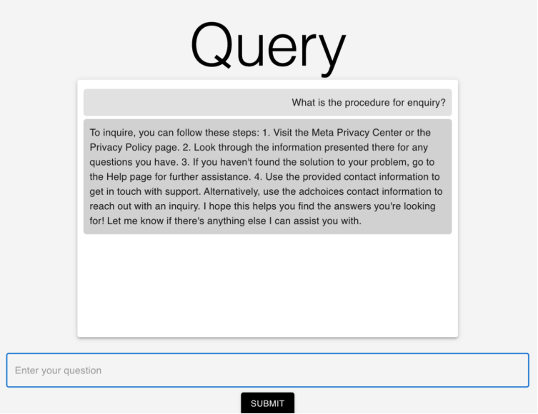

# Contextual Knowledge Search Platform

## Overview

This project is a secure, on-premise contextual knowledge search platform designed to efficiently retrieve and navigate large volumes of documents. By leveraging advanced language models, such as Cohere, and combining them with Retrieval-Augmented Generation (RAG) techniques, the platform aims to provide accurate and contextually relevant responses to user queries. The system also addresses data privacy concerns by operating within a secure environment.



## Features

- **Document Upload**: Upload multiple PDF files to be processed and indexed.
- **Contextual Querying**: Ask questions related to the content of the uploaded documents.
- **On-Premise Deployment**: Secure, local handling of data to ensure privacy and regulatory compliance.
- **Language Model Integration**: Utilizes Cohere's embeddings and language models for improved information retrieval and generation.

## Architecture


### High-Level Architecture

The platform architecture is designed to handle document ingestion, context retrieval, and query processing efficiently. The main components include:

1. **Document Ingestion:** Upload and processing of PDF documents to extract and split text content.
2. **Embedding Generation:** Conversion of document text into vector embeddings using language model embeddings.
3. **Context Retrieval:** Retrieval of relevant document chunks based on query similarity.
4. **Question Answering:** Generation of accurate responses based on retrieved context.

### Detailed Architecture

1. **Document Upload and Processing**
   - Users upload PDF documents via a web interface.
   - The Flask backend processes these files, splits the content into manageable chunks, and stores them in MongoDB.

2. **Embedding Generation**
   - **Embedding Model:** Cohere’s `embed-multilingual-v2.0` model is used to generate high-quality embeddings for document chunks.
   - **Storage:** Embeddings are stored in ChromaDB for efficient retrieval.

3. **Context Retrieval**
   - **Vector Database:** ChromaDB stores document embeddings and supports fast similarity searches.
   - **Similarity Measure:** Cosine similarity is used for efficient context retrieval, avoiding the computational cost of TF-IDF and BERT-based methods.

4. **Question Answering**
   - **LLM:** Cohere’s model is utilized to generate responses based on the retrieved context.
   - **Prompt Template:** A custom prompt template is used to structure the query and context for the LLM.

### Language Model Used

   **Cohere**
   - **Capabilities:** Efficient attention mechanism with high accuracy in text classification and question answering tasks.
   - **Advantages:** Open-source, providing greater control over data privacy and regulatory compliance.

 

### Methodology

1. **Document Chunking and Splitting**
   - **Chunk Size:** Adjustable chunk size and overlap parameters to balance context depth and processing speed.

2. **Embedding and Storage**
   - **Embedding Model:** Cohere’s model generates embeddings that capture nuanced details of the document text.
   - **Storage:** Embeddings and text chunks are stored in MongoDB and ChromaDB.

3. **Query Processing**
   - **Context Retrieval:** Uses cosine similarity to fetch relevant document chunks.
   - **Response Generation:** LLM generates answers based on the retrieved context using a predefined prompt template.
   
## Technologies

- **Backend**: Flask
- **Database**: MongoDB
- **Vector Store**: ChromaDB
- **Language Model**: Cohere
- **Text Processing**: LangChain
- **Frontend**: React
- **Styling**: Material-UI


## Evaluation Metrics

The effectiveness of the platform is evaluated using the following metrics:

1. **Context Relevance:** Measures how well the retrieved context aligns with the query.
2. **Groundedness:** Assesses if the response is grounded in the retrieved context.
3. **Answer Relevance:** Evaluates if the generated answer effectively addresses the user’s query.

Metrics:
- **Context Relevancy:** 9.0
- **Answer Relevancy:** 10.0
- **Groundedness:** 6.5


## Installation

1. **Clone the repository**

    ```bash
    git clone <repository-url>
    cd <repository-directory>
    ```

2. **Install dependencies**

    **Backend**

    ```bash
    pip install -r requirements.txt
    ```

    **Frontend**

    ```bash
    cd client
    npm install
    ```

3. **Set up environment variables**

    Create a `.env` file in the root directory with the following content:

    ```bash
    COHERE_API_KEY=your-cohere-api-key
    MONGO_URI=your-mongodb-uri
    ```

4. **Run the backend server**

    ```bash
    python app.py
    ```

5. **Run the frontend**

    ```bash
    cd client
    npm start
    ```

## API Endpoints

- **`POST /upload`**

    Upload PDF files for processing. The files will be split into chunks, embedded, and stored in MongoDB.

    **Request Body:**

    ```json
    {
      "files": [<file1>, <file2>, ...]
    }
    ```

    **Response:**

    ```json
    {
      "message": "Files processed and embeddings stored. Please ask your question."
    }
    ```

- **`POST /query`**

    Submit a query related to the uploaded documents. The system will return a contextually relevant response.

    **Request Body:**

    ```json
    {
      "question": "Your question here"
    }
    ```

    **Response:**

    ```json
    {
      "answer": "The generated answer based on the query"
    }
    ```

## Frontend Usage

1. **Upload PDF Files**

    - Click "Choose Files" to select and upload multiple PDF files.
    - Click "Upload" to start the processing.

2. **Querying**

    - After files are uploaded, enter your question related to the content of the documents.
    - Click "Submit" to receive an answer from the system.

3. **New Upload**

    - Click "New Upload" to reset the interface and upload new files.

## Development

For local development, ensure you have Python, Node.js, and MongoDB installed. You can configure the application to run on different environments by adjusting the `.env` file.
